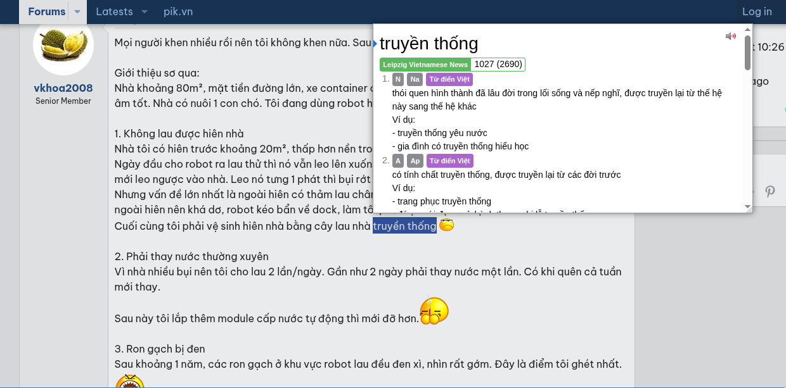
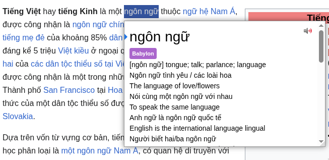
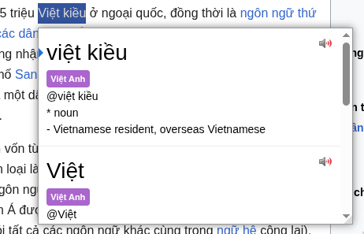
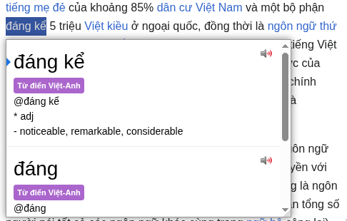
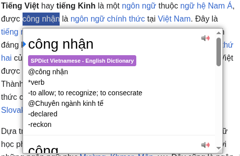
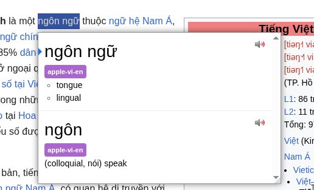
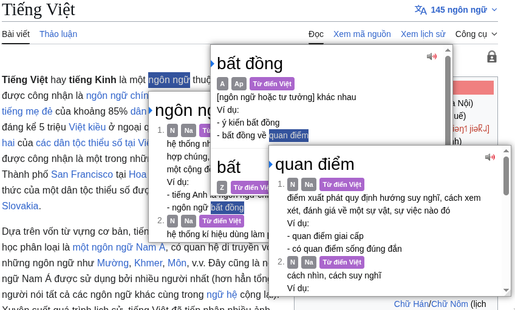
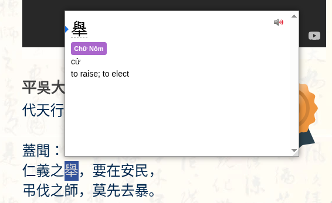
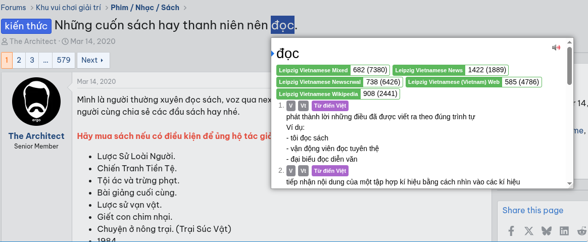

A collection of Vietnamese dictionaries for Yomitan.

- [Vietnamese - English](#vietnamese---english)
- [Vietnamese Monolingual Dictionaries](#vietnamese-monolingual-dictionaries)
- [Chu Nom](#chu-nom)
- [Term Frequency](#term-frequency)

## Vietnamese - English

- [VNEDICT](dictionaries/vnedict-v4.zip) - Paul Denisowski converted by Marsh Nguyễn for Yomichan.
  
    
- [Babylon Vietnamese - English Dictionary](dictionaries/babylon-vi-en-v2.zip)

    
- [Hồ Ngọc Đức's Vietnamese - English Dictionary](dictionaries/dictd_viet-anh.zip) -  This dictionary is from 'The Free Vietnamese Dictionary Project' by the author [Hồ Ngọc Đức](https://www.informatik.uni-leipzig.de/~duc/Dict/install.html)

    
- [OVDP Vietnamese - English Dictionary](dictionaries/ovdp-vi-en-v2.zip) - From [OVDP (Open Vietnamese Dictionary Project)](https://github.com/dynamotn/stardict-vi).

    
- [SPDict Vietnamese - English Dictionary](dictionaries/spdict-viet-anh.zip) - From [Super Power Dict For Java](https://download.com.vn/super-power-dict-for-java-27941) by Bùi Đức Tiến, an open-source Vietnamese dictionary.

     
- [Apple Vietnamese-English Dictionary](dictionaries/apple-vi-en.zip)

    
- [Từ điển Lạc Việt](https://drive.proton.me/urls/6HPT2926MM#GBvWNTQJKCXw)

## Vietnamese Monolingual Dictionaries

- [Từ điển Tiếng Việt thông dụng](dictionaries/tu-dien-tieng-viet-thong-dung.zip) - Vie-Vie dictionary converted by Marsh Nguyễn. The dictionary data is from Từ Điển Tiếng Việt Thông Dụng and was sourced from <https://github.com/vntk/dictionary/tree/master/data> contains 42012 entries.
    
- [Vietnamese Dictionary - Hồ Ngọc Đức](dictionaries/vi-vi.zip) - This dictionary is from 'The Free Vietnamese Dictionary Project' by the author [Hồ Ngọc Đức](https://www.informatik.uni-leipzig.de/~duc/Dict/install.html) (Converted by Marsh Nguyễn to Yomichan format)

## Chu Nom

- [Chữ Nôm Dictionary](dictionaries/chu-nom.zip) - Chữ Nôm Dictionary converted by Marsh Nguyễn. The data comes from <https://chunom.org> The dictionary contains 1,569 entries.
    

## Term Frequency

Frequency lists for Yomitan created from the [Leipzig Corpora Collection](https://wortschatz.uni-leipzig.de/en/download/) by [StefanVukovic99](https://github.com/StefanVukovic99) (Thanks [chatterine](https://github.com/chatterine) for the suggestion).

- [Mixed](dictionaries/freq/Leipzig.Vietnamese.Mixed.zip)
- [News](dictionaries/freq/Leipzig.Vietnamese.News.zip)
- [Newscrwal](dictionaries/freq/Leipzig.Vietnamese.Newscrwal.zip)
- [Vietnam Web](dictionaries/freq/Leipzig.Vietnamese.Vietnam.Web.zip)
- [Wikipedia](dictionaries/freq/Leipzig.Vietnamese.Wikipedia.zip)